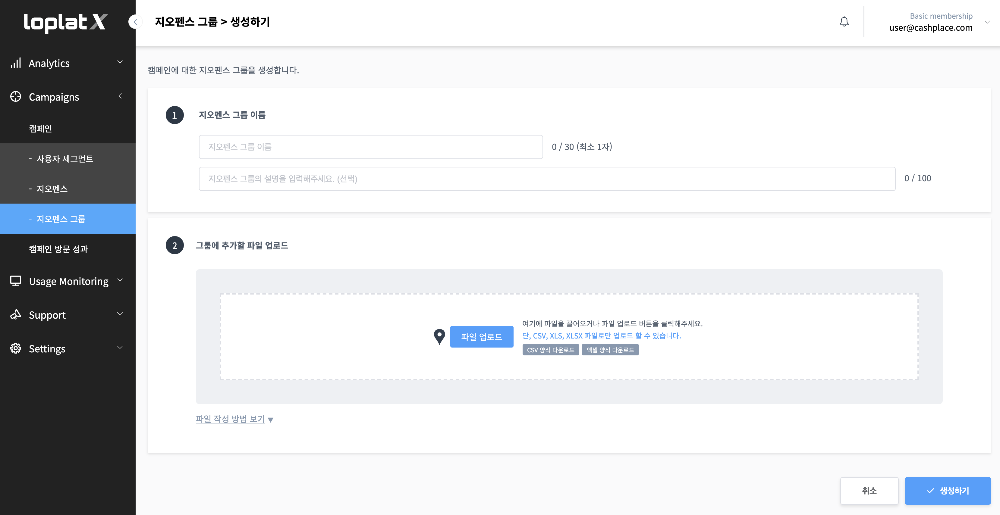

# 지오펜스 그룹

.png>)

**지오펜스 그룹은 여러개의 지오펜스를 그룹핑하여 CSV 또는 엑셀 파일로 업로드하여 설정합니다.**

좌측 메뉴에서 **‘Locations > 지오펜스 그룹’** 메뉴를 클릭하면 지오펜스 그룹 등록을 위한 가이드 화면이 표시됩니다.

**지오펜스 그룹은 아래 3가지 절차를 통해서 등록할 수 있습니다.**

.png>)

### **1. 이름 /설명 입력**

\- **이름** (필수) : 지오펜스 그룹 이름을 입력합니다.\
\- **설명** (선택) : 지오펜스 그룹에 대한 상세한 설명을 입력합니다.

### 2. 파일 업로드

.png>)


파일 업로드는 CSV, 엑셀(xls, xlsx) 파일만 가능합니다.


**\* 파일 작성하는 방법**

1\. 샘플 양식을 다운로드하고 엑셀에서 파일을 엽니다.

2\. 업로드할 내용을 아래 항목 순으로 작성합니다.\
정합성 체크 시 아래 양식과 다를 경우 등록이 되지 않을 수 있으니 항목 순서를 꼭 확인해주세요.


주소 기준으로 작성 시, 지오펜스 유형/반경/이름/번지 주소(또는 도로명 주소)는 필수 입력 항목입니다.


.png>)

주소는 아래와 같은 조합으로 작성해주셔야 오류가 발생하지 않습니다.

**- 지번 주소 작성 시**\
**‘도/시/구명 + 지역명(동/리) + 번지’ 까지만 입력**

유형 1) 서울시 서초구 서초동 1338-12 (권장)\
유형 2) 서울시 서초구 서초동 1338-12, 11층\
유형 3) 서울시 서초구 서초동 1338-12 (한화생명보험)

\- **도로명 주소 작성 시**\
**‘도/시/구명 + 도로명 + 건물번호’ 까지만 입력**

유형 1) 경기도 성남시 분당구 서현로210번길 2 (권장)\
유형 2) 경기도 성남시 분당구 서현로210번길 2, 102동\
유형 3) 경기도 성남시 분당구 서현로210번길 2 (서현동)\
유형 4) 경기도 성남시 분당구 서현로210번길 2 (성지하이츠텔)


**위/경도 기준으로 작성 시,** **지오펜스 유형/위도/경도/반경/이름**은 필수 입력 항목입니다.\
지오펜스 유형의 코드번호는 ‘1’이며, m 단위로 입력해야 합니다. 예) 1km인 경우 ‘1000’으로 입력


.png>)


**Polygon 기준으로 작성 시, 지오펜스 유형/Polygon/이름**은 필수 입력 항목입니다.\
지오펜스 유형의 코드번호는 ‘0’이며, Polygon 입력 시 ‘( )’는 필수 정보입니다.\
예) (127.11 37.11,127.22 37.11,127.22 37.22,127.11 37.22,127.11 37.11)


.png>)

3\. 작성 후 저장하고 파일을 업로드 합니다.

### 3. 등록완료

.png>)

‘생성하기’ 버튼을 클릭하면 등록이 되며, 아래 **\[목록 화면]**으로 이동합니다.\
등록하고자 하는 데이터의 양에 따라서 1분에서 수십 분까지 소요될 수 있으며, 업로드 순으로 등록 완료됩니다.\
목록에서 상태 표시가 **‘검사 중'**으로 나타나며, 등록이 완료되면 **‘사용 가능'**으로 변경됩니다.\
‘취소' 버튼을 클릭하면 입력한 모든 정보가 사라지고 바로 이전 페이지로 돌아갑니다.

### 4. 지오펜스 그 목록

.png>)

1\) ‘생성하기’ 버튼을 클릭하면 지오펜스 그룹 등록 화면으로 이동합니다.

2\) 아래 목록에서 체크박스를 선택하고 ‘선택한 지오펜스 그룹 삭제' 버튼을 클릭하면 선택된 항목들이 삭제됩니다.

3\) 목록 노출 개수는 15개/30개/50개/100개/200개까지 설정할 수 있습니다.

4\) 총 목록 수입니다.

5\) 지오펜스 그룹 ID입니다.

6\) 지오펜스 그룹 이름입니다.

7\) 지오펜스 그룹에 대한 상세 설명입니다.

8\) 지오펜스 그룹 활성 상태 표시입니다. 활성 / 비활성을 눌러 **활성 지오펜스 그룹 캠페인 목록**을 확인할 수 있으며,\
캠페인 상태를 변경할 수 있습니다.

* 활성 상태: 활성 지오펜스 그룹 캠페인 목록에 캠페인이 한개 이상 진행중인 상태
* 비활성화 상태: 활성 지오펜스 그룹 캠페인 목록에 캠페인이 모두 대기중인 상태

9\) 지오펜스 그룹의 지오펜스 전체 수입니다.

9-1) 확대 아이콘을 클릭하면 해당 지오펜스의 \[지도뷰 팝업] 확인할 수 있습니다.

.png>)


등록한 지오펜스 그룹의 정보를 확인할 수 있습니다.

1\. 지오펜스의 이름입니다.

2\. 지오펜스의 설명글입니다.

3\. Polygon 수입니다.

4\. Circle 수입니다.

5\. 등록한 지오펜스의 주소를 입력한 후 검색하면 해당 구역을 지도 화면에서 확인할 수 있습니다.

6\. 등록한 지오펜스 정보들을 확인할 수 있습니다.

6-1. 확대/축소 버튼입니다.

7\. ‘닫기' 버튼을 클릭하면 팝업 창이 닫힙니다.


10\) 지오펜스 그룹을 생성한 사용자입니다.

11\) 지오펜스 그룹을 생성한 날짜입니다.

12\) 지오펜스 그룹을 수정한 날짜입니다.

13\) ‘수정’ 버튼을 클릭하면 \[수정 화면]으로 이동합니다.

####
